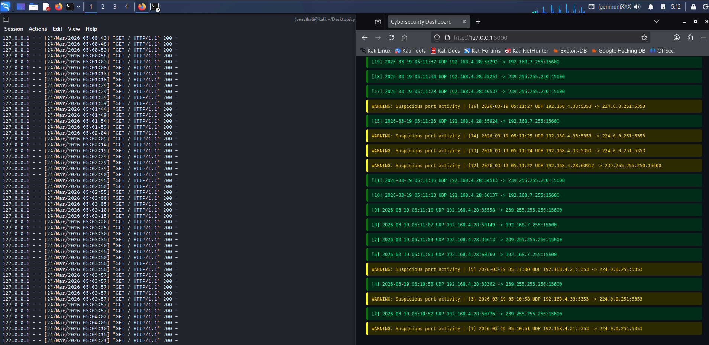

# Cybersecurity Dashboard

## Overview

Cybersecurity Dashboard is a Flask-based web application that monitors and visualizes network traffic logs in real time.

It integrates with a packet sniffer to display live network activity and detect potential security threats. The dashboard simulates a basic **Security Operations Center (SOC)** monitoring system.

---

## Dashboard Preview

---

## Features

- Real-time network log monitoring
- Displays packet data (IP, ports, protocol)
- Auto-refresh dashboard (every 5 seconds)
- Clean cybersecurity-style UI

---

## Advanced Features

-  Live statistics (Total, TCP, UDP, ICMP)
-  Warning detection (suspicious ports like 22, 3389)
-  Critical alerts (possible attack patterns)
-  Log file integration (`packet_log.txt`)

---

## Technologies Used

- Python
- Flask
- HTML / CSS (Jinja2 templates)

---

## Project Structure

cybersecurity-dashboard
│
├── app.py
├── templates/
│ └── index.html
├── requirements.txt
└── README.md

---

## Installation

Clone the repository:

git clone https://github.com/Pravat25/cybersecurity-dashboard.git

Navigate into the folder:

cd cybersecurity-dashboard

Create virtual environment:

python3 -m venv venv

Activate it:

source venv/bin/activate

Install dependencies:

pip install flask

---

## How to Run

Run the application:

python app.py

Open in browser:

http://127.0.0.1:5000

---

## Example Output

WARNING: Suspicious port activity | TCP 192.168.1.5:22 -> 10.0.0.1:443
CRITICAL: Possible attack detected | Failed login attempt from 192.168.1.10

---

## Integration

This dashboard reads logs from:

../packet-sniffer/packet_log.txt

Make sure your packet sniffer is running.

---

## Learning Purpose

This project demonstrates:

- Real-time log monitoring
- Basic threat detection
- SOC dashboard concepts
- Flask web development

---

## Disclaimer

This project is for **educational purposes only**.
